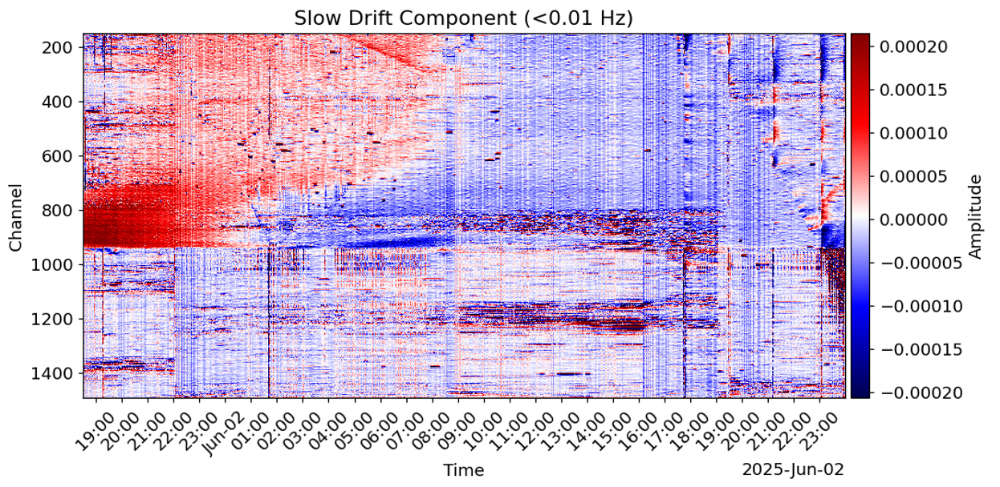

# OpenDAS-Stream: High-Performance Streaming Analytics for Extreme-Scale Fiber-Optic Sensing

[](https://www.python.org/downloads/)
[](https://developer.nvidia.com/cuda-zone)
[](https://www.icds.psu.edu/)

## 🚀 Overview
**OpenDAS-Stream** is a high-performance computational framework designed to transform 100-Terabyte-scale Distributed Acoustic Sensing (DAS) data into actionable geohazard insights. Developed as part of the **ICDS Rising Researcher** initiative, this engine leverages GPU-accelerated stream processing to handle continuous, high-velocity acoustic data from deep subsurface environments.

## ✨ Key Features
* **GPU-Accelerated Kernel**: Seamless integration with NVIDIA GPUs via CuPy for ultra-fast filtering, downsampling, and RMS energy computation.
* **Streaming-First Architecture**: Implements an `Overlap-Save` chunk processing pipeline, enabling the analysis of TB-scale datasets without memory overflow.
* **Physics-Informed Analytics**:
    * **LFDAS**: Extraction of ultra-low-frequency strain drift associated with quasi-static deformation.
    * **F-K Analysis**: Frequency-Wavenumber wavefield separation for identifying seismic event directionality.
    * **FBE-RMS**: Multi-scale frequency band energy mapping for microseismic and blasting detection.
* **Modular Pipeline**: Highly extensible core (`compute_core.py`) and visualization engine (`plotters.py`) designed for AI-driven geohazard indicator development.

## 🛠️ System Architecture
The codebase is structured for scalability and researcher collaboration:
* `main.py`: The central orchestration engine for batch and streaming workflows.
* `filter_core.py`: Hardware-abstraction layer supporting both CPU (SciPy) and GPU (CuPy) backends.
* `compute_core.py`: Implementation of geophysical signal processing algorithms.
* `plotters.py`: A visualization suite for temporal and spatial data diagnostics.

## 📊 Analytics Demo: Subsurface Stress Evolution
The following figure demonstrates the framework's capability by processing **4.5 TB** of continuous DAS data in 15 minutes. It highlights the extraction of the **Slow Drift Component (< 0.01 Hz)**, revealing long-term strain accumulation and quasi-static deformation patterns.


*Figure: High-fidelity LFDAS heatmap capturing spatiotemporal strain evolution during a 30-hour cement hydration and cooling sequence in a horizontal wellbore.*
Unlike traditional event-based analysis, this platform aims to enable near-real-time monitoring of stress redistribution, induced seismicity, and geohazard precursors in complex geologic systems.
  

## 📊 Quick Start
```python
# Minimal example to enable GPU-accelerated streaming
USE_STREAMING_PROCESSING = True
DO_COMMON_MODE = True
COMMON_MODE_METHOD = "median"
